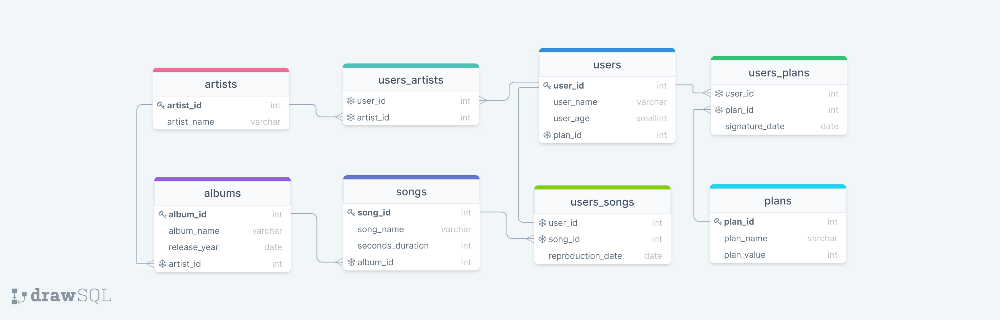

# Mysql-one-for-all

<p align="center">

 
</p>

## 💻 Projeto

Nesse aplicação foi normalizada e populada  um tabela, e em seguida executado várias queries com o intuito de encontrar as informações solicitadas. Desenvolvido no curso da [Trybe](https://www.betrybe.com/). 

## 🚀 Tecnologias
Esse projeto foi desenvolvido com as seguintes tecnologias:

> MySQL

## 📌 Habilidades

Nesse projeto, fui capaz de:

- Normalizar tabelas
- Criar bando de dados
- Criar tabelas
- Criar colunas
- Inserir valores em tabelas
- Filtrar e manipular dados


## ⬇️ Instalando dependências

  ```bash
  cd src/
  npm install
  ``` 
